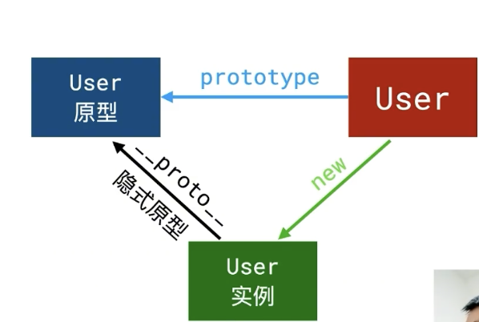

闭包是一个函数以及其捆绑的周边环境状态（lexical environment，词法环境）的引用的组合
可以理解为一种状态，在函数声明的时候，闭包也就形成了。

作用： 
1.读取函数内部的变量
2.变量始终保持在内存中，不会在调用后被清除

缺点：
1. 始终存在内存中，内存消耗很大，造成性能问题，解决方法是不使用时及时删除。
2. 闭包会改变父函数的值，会被随意更改！

原型：
在JavaScript中，所有的函数默认都会拥有一个名为prototype的公有且不可枚举的属性，
它会指向另一个对象：这个对象通常被称为函数的原型。
简单来说，prototype就是函数的一个属性，这个prototype的属性值是一个对象（对象是属性的集合）。

当使用new操作符时，会把prototype 赋值给实例的__proto__ 原型实例.

__proto__：是每个 对象 都有的一个隐式原型

原型链：
每个对象都有一个原型对象与之关联。这个原型对象也是一个普通对象，这个普通对象也有自己的原型对象，这样层层递进，就形成了一个链条/

作用：实现JS的继承，把父类的原型对象赋值给子类的原型

